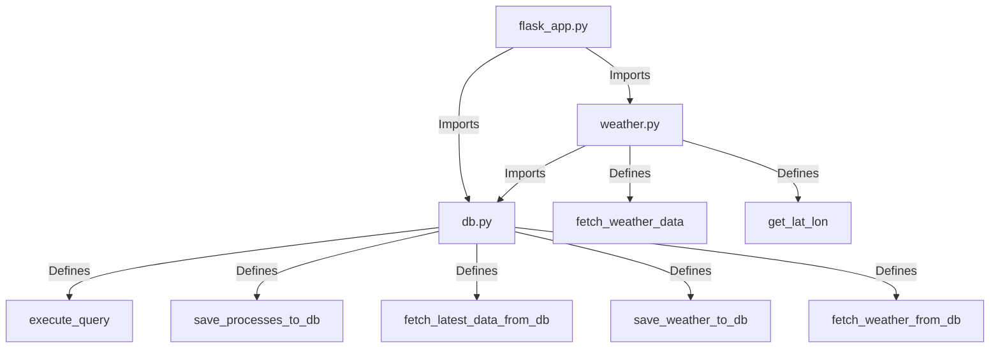

# Project Architecture

<!-- [MermaidChart: 370553ca-6de3-4b58-87f5-11ddae6514cc] -->

```mermaid
---
id: 370553ca-6de3-4b58-87f5-11ddae6514cc
---
graph TD
    A[flask_app.py] -->|Imports| B[db.py]
    A -->|Imports| C[weather.py]
    B -->|Defines| F[execute_query]
    B -->|Defines| G[save_processes_to_db]
    B -->|Defines| H[fetch_latest_data_from_db]
    B -->|Defines| I[save_weather_to_db]
    B -->|Defines| J[fetch_weather_from_db]
    C -->|Imports| B[db.py]
    C -->|Defines| L[fetch_weather_data]
    C -->|Defines| M[get_lat_lon]
```
